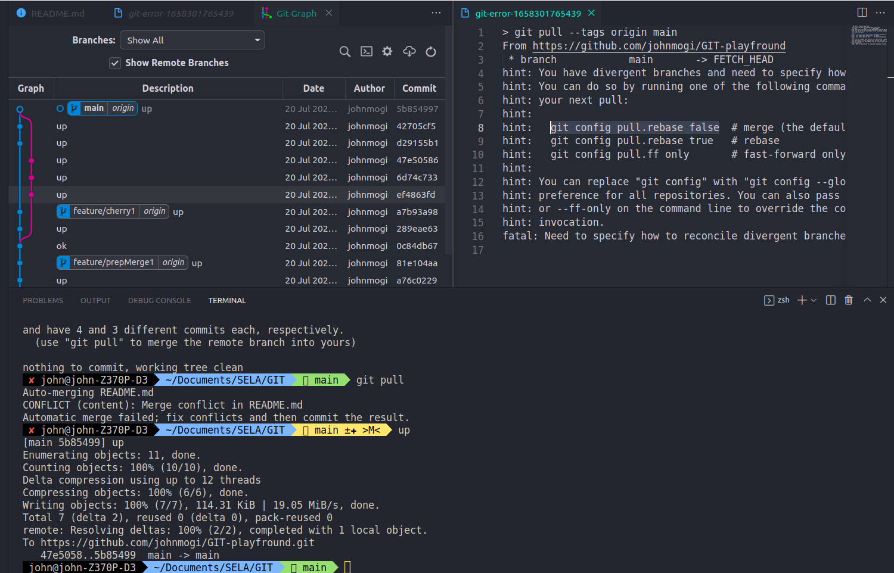

# GIT-playfround

GIT [practice for fun]

## upload changes:
<pre>
git add -A
git commit -m 'new upload'
git push
</pre>
## create a feature branch:
<pre>

git checkout -b feature/prepMerge1
# manually add a file 
# up ( upload changes )
# up ( upload changes )
git push --set-upstream origin feature/prepMerge1
git checkout main
git merge feature/prepMerge1
</pre>
## Cherry pick from a feature branch:
<!-- let's try a git cherry pick with rebase -->
<pre>
git checkout -b feature/cherry1
# manually add 2 files : 1 good, 1 bad  - 2 commits
# up ( upload changes )
git push --set-upstream origin feature/cherry1
git checkout main
git cherry-pick feature/cherry1
</pre>
# status:
would like to repractice cherry pick and rebase to flatten the curve

